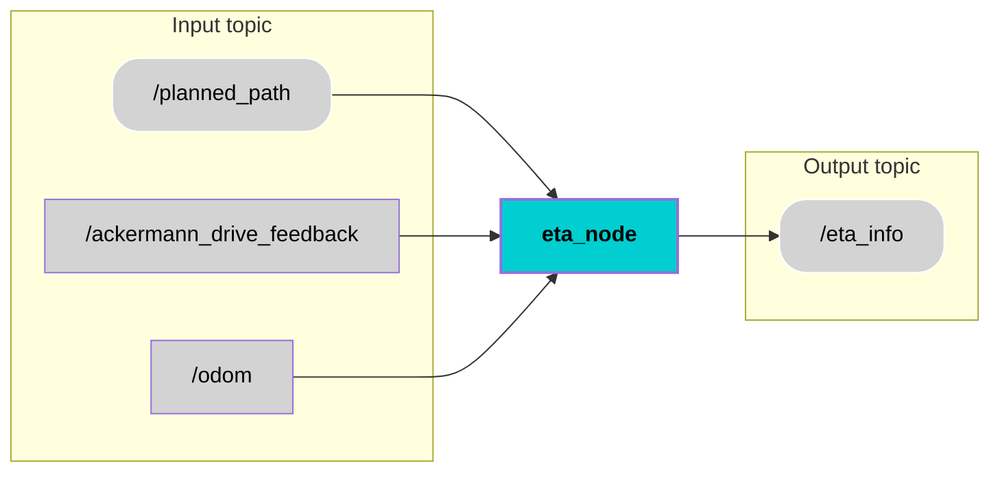

<div align="center">
  <h1 style="font-size: 36px;">Estimated Time of Arrival</h1>
</div>

## 📚 Contents
- [Description](#description)
- [Architecture](#architecture)
- [Interfaces](#interfaces)
- [Custom Messages](#custom-messages)
- [User Stories](#user-stories)
- [Installation](#installation)
- [Usage](#usage)
- [Contributor](#contributor)
- [License](#license)

## 🧠 Description


The ETA (Estimated Time of Arrival) component computes the remaining travel time of the autonomous shuttle in real time by analyzing the planned path, current vehicle position, and motion state. It continuously estimates the distance to the destination and converts it into an arrival time using the current speed, ensuring stable behavior even at low velocities. The computed ETA is published as a lightweight ROS 2 topic, enabling seamless integration with HMIs, backend services, and interanl application for clear and reliable arrival information for the users.


## 🧩 Architecture

## 🔌 Interfaces 

### Topics:
| Name                         | IO           | Type                 | Description                                                              |
|------------------------------|----------------------|----------------------|--------------------------------------------------------------------------|
| `/planned_path `        | Input   | `nav_msgs/msg/Path.msg`   | Receives the planned global path as a sequence of waypoints used to compute the remaining travel distance.  |
| `/ackermann_drive_feedback`         | Input     | `ackermann_msgs/msg/AckermannDrive.msg`      |  Receives current speed of the vehicle.             |
| `/odom`         | Input    | `nav_msgs/msg/Odometry.msg`      |  Provides the vehicle’s current position, orientation, and velocity required for ETA calculation.     |
| `/eta_info`         | Output    | `std_msgs/msg/Int32.msg`      |  Publishes the estimated time of arrival encoded as minutes and seconds (MMSS) for downstream systems and HMI.     |


## Custom Messages
There are no custom messages used for this component.


## 🎯 User Stories
[US6.7](https://miro.com/app/board/uXjVI9mh4O0=/?moveToWidget=3458764652249942335&cot=14) : Estimation of ETA 


## 🛠️ Installation
1. Create workspace
```bash
mkdir eta_ws
cd eta_ws
```
2. Clone component repository
```bash
git clone https://git.hs-coburg.de/pax_auto/eta.git
```
3. Build the package.
```bash
colcon build
```
4. Source the setup files
```bash
source install/setup.bash
```

## ▶️ Usage
Run the node:
```bash
ros2 run eta_component eta_node
```

## 🧑‍💻 Contributor
[Mahitha Balachandran Sheeja ](https://git.hs-coburg.de/mah5338s)

## 🔒 License
Licensed under the **Apache 2.0 License**. See [LICENSE](LICENSE) for details.


