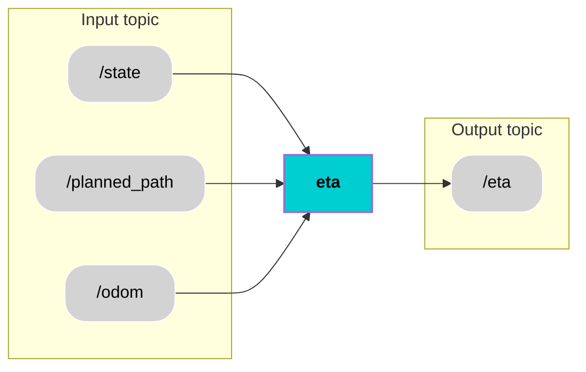

<div align="center">
  <h1 style="font-size: 36px;">Estimated Time of Arrival</h1>
</div>

## 📚 Contents
- [Description](#-description)
- [Architecture](#-architecture)
- [Interfaces](#-interfaces)
- [User Stories](#-user-stories)
- [Installation](#-installation)
- [Usage](#-usage)
- [Contributor](#-contributor)
- [License](#-license)

## 🧠 Description


The ETA feature provides users with a real-time estimate of the shuttle’s arrival time at its destination in the internal user interface (after the user is boarded). This is calculated dynamically based on the shuttle’s current position and velocity (from /odom) and the planned path (from /planned_path). ETA updates are continuously published to the /eta topic as a float representing seconds since epoch.

### Functionality / Properties:
- The ETA feature continuously calculates the estimated time of arrival (when user is inside the shuttle) based on the shuttle’s current position, velocity and its remaining distance to the destination (taking into account both the path already travelled and the planned path ahead).

- ETA is dynamically adjusted whenever the shuttle stops, whether due to traffic lights, obstacles, or other temporary interruptions, ensuring that the user receives a realistic prediction of the arrival time under varying conditions.

- To reduce sudden fluctuations caused by rapid changes in velocity or small positional updates, the feature implements a moving-average smoothing algorithm, which averages recent ETA values to provide a stable and easily interpretable estimate.

- Additionally, the feature logs key information including the departure time, the current calculated ETA, the shuttle’s instantaneous velocity, and the index of the first remaining waypoint, which can be used for debugging, visualization, or integration with a user interface to give end-users continuous insight into the shuttle’s progress.

## 🧩 Architecture

## 🔌 Interfaces 

### Topics:
| Name                         | IO           | Type                 | Description                                                              |
|------------------------------|----------------------|----------------------|--------------------------------------------------------------------------|
| `/planned_path `        | Input   | `nav_msgs/msg/Path.msg`   | Receives the planned global path as a sequence of waypoints used to compute the remaining travel distance.  |
| `/odom`         | Input    | `nav_msgs/msg/Odometry.msg`      |  Provides the vehicle’s current position, orientation, and velocity required for ETA calculation.     |
| `/eta`         | Output    | `std_msgs/msg/Float64.msg`      |  Publishes the estimated time of arrival encoded as seconds since epoch     |


## Custom Messages
There are no custom messages used for this component.


## 🎯 User Stories
[US 6.7](https://miro.com/app/board/uXjVI9mh4O0=/?moveToWidget=3458764652249942335&cot=14) : Estimation of ETA 

[US 6.1](https://miro.com/app/board/uXjVI9mh4O0=/?moveToWidget=3458764658946860936&cot=14) : Making ETA robust by handling temporary stop (0.0 m/s), computing only after user is boarded and optimization of remaining distance calculation.

## 🛠️ Installation
1. Create workspace, src and go to src
```bash
mkdir temp_ws
cd temp_ws
mkdir src
cd src
```
2. Clone component repository
```bash
git clone https://git.hs-coburg.de/pax_auto/eta.git
```
3. Return to workspace and build the packages
```bash
cd ..
colcon build
```
5. Source the setup files
```bash
source install/setup.bash
```

## ▶️ Usage
Launch the eta node
```bash
ros2 run eta eta
```

## 🧑‍💻 Contributor
[Surendrakumar Koganti](https://git.hs-coburg.de/sur7933s) and [Mahitha Balachandran Sheeja ](https://git.hs-coburg.de/mah5338s)

## 🔒 License
Licensed under the **Apache 2.0 License**. See [LICENSE](LICENSE) for details.


